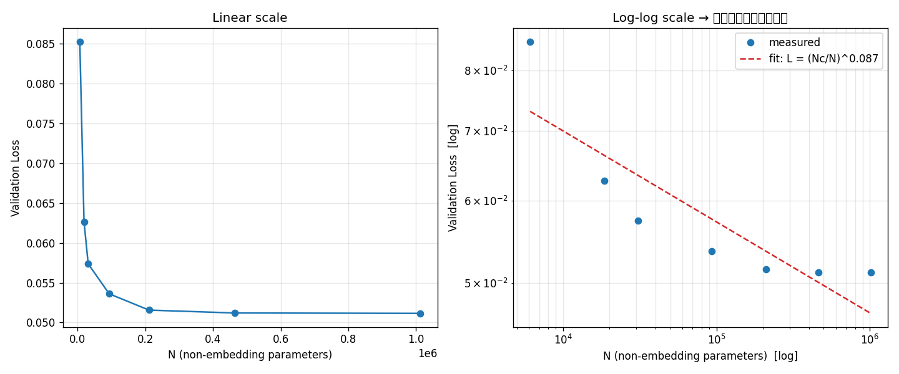

# Day4: スケール則と Chinchilla 則

「モデルを大きくすればするほど賢くなる」という経験則（スケール則）を実験で確認し、
限られた計算予算をモデルサイズ N とデータ量 D にどう配分すべきか（Chinchilla 則）を検証する。

---

## 基礎編 `day4_scaling_law.py`

モデルサイズを7段階変えて学習し、(N, loss) が両対数グラフ上で直線（べき乗則）に
乗ることを確認。べき乗則フィットで指数 α を推定する。

```bash
python day4/day4_scaling_law.py
```

**実行結果:**
```text
=== モデルサイズを変えて学習 ===
d_model=  16 layers=1 | N(non-emb)=    6,117 | val loss=0.0852
d_model=  24 layers=2 | N(non-emb)=   18,621 | val loss=0.0627
d_model=  32 layers=2 | N(non-emb)=   30,917 | val loss=0.0574
d_model=  48 layers=3 | N(non-emb)=   92,997 | val loss=0.0536
d_model=  64 layers=4 | N(non-emb)=  210,789 | val loss=0.0516
d_model=  96 layers=4 | N(non-emb)=  463,557 | val loss=0.0512
d_model= 128 layers=5 | N(non-emb)=1,012,901 | val loss=0.0512

=== フィット結果 ===
傾き (両対数上) = -0.0873
alpha_N        = 0.0873
Nc             = 5.9810e-10
→ スケール則: L(N) = (Nc / N)^alpha = (5.981e-10 / N)^0.0873

【参考】Kaplan+ 2020 の実測値は alpha_N ≈ 0.076
   （今回は極小データ・極小モデルなので値は一致しません。
     「両対数で直線に乗る」という性質そのものを確認するのが目的です）
```



N=46万 と 101万 で loss がほぼ同じ＝**データ量が足りないとモデルだけ大きくしても頭打ち**
になる（データ律速）。これが次の Chinchilla 則の伏線になる。

---

## 深掘り編 `day4_chinchilla_deepdive.py`

計算最適配分の「なぜ」を4つの実験で検証する。

```bash
python day4/day4_chinchilla_deepdive.py
```

### 実験1: 計算量の近似式 C ≈ 6ND
```text
GPT-3: N=175B, D=300B トークン
  推定計算量 C = 6ND = 3.15e+23 FLOPs
  （講義資料の GPT-3 実測値 3.14e23 FLOPs とほぼ一致）
```

### 実験3: GPT-3 は本当に「大きすぎた」のか
```text
GPT-3の実際の配分:  N=175B, D=300B → Loss=2.0023, D/N=1.7
同予算の最適配分:    N=24B, D=2145B → Loss=1.9541, D/N=87.6

→ GPT-3はモデルが大きすぎ・データが少なすぎ(D/N=1.7しかない)。
  同じ計算量でも、もっと小さいモデルを多くのデータで訓練した方が
  損失が下がる(2.0023 → 1.9541)。これがChinchillaの主張。
  実際Chinchilla(70B)は より大きいGopher(280B)に勝った。
```

同じ計算予算でも、小さいモデルを多くのデータで訓練した方が損失が下がる
＝ **GPT-3 はモデルが大きすぎ・データ不足**（D/N=1.7）という Chinchilla の主張を再現。

### 実験4: 推論コストも考えると最適サイズが変わる（Beyond Chinchilla）
```text
目標損失 2.3 を、推論回数の想定別に最も安く達成する配分:

         推論トークン数         最適N           最適D     D/N
           0e+00    2.11e+09      1.07e+11      51  学習のみ(Chinchilla)
           1e+11    1.53e+09      1.53e+11     100  
           1e+13    5.04e+08      1.40e+12    2779  
           1e+15    2.83e+08      3.51e+13  124112
```

推論回数が増えるほど最適な N は小さく・D は大きくなる。
「たくさん推論するなら小さいモデルを長く学習」が正解で、これが Llama 等の設計思想。
