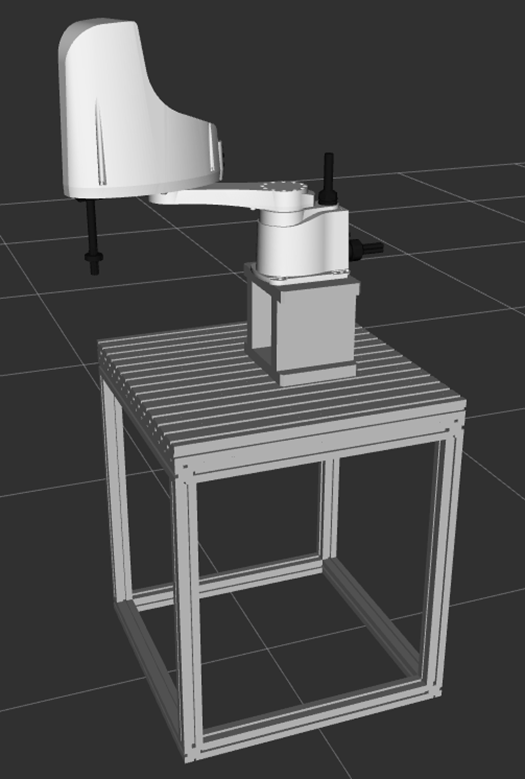
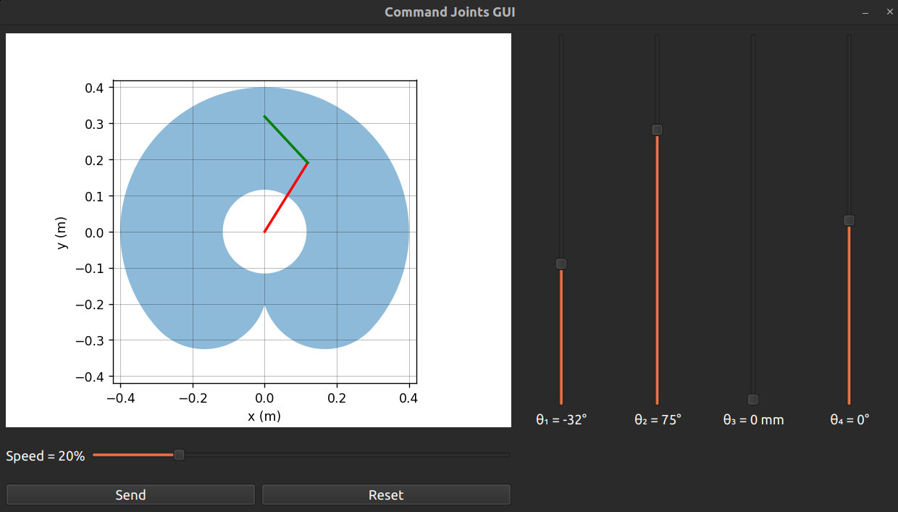
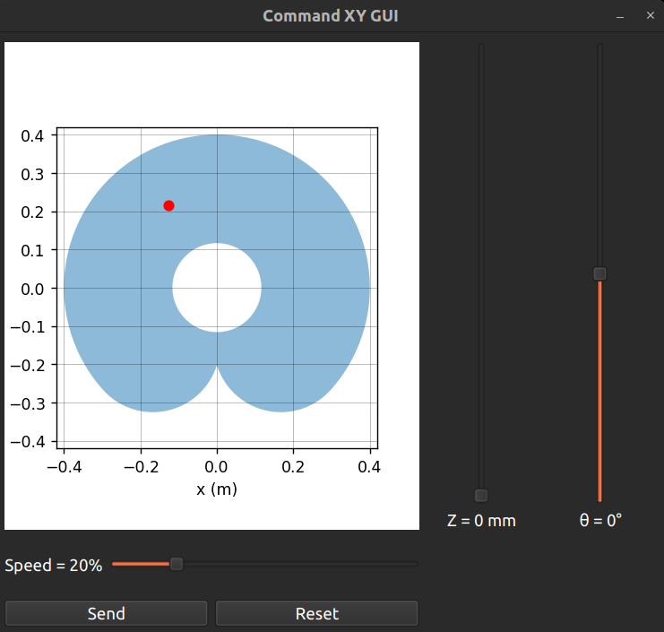

# Yamaha project
This repository compiles all the packages to use the YK400XE Yamaha robot. 
> [!NOTE]   
> This repository is based on [yk400xe_ros2](https://github.com/Sappy27/yk400xe_ros2). For more details on the ROS2 port of the RCX340 and YK400XE, read the documentation of this repository.  
<p align="center">
    <a href="" rel="noopener">
    </a>
</p> 

For questions or further information, please contact the current maintainer of the project :  
|       Name       |   From  |    To   |              Contact              |        
|:----------------:|:-------:|:-------:|:---------------------------------:|
| Vincent BOUFAROUA|  START  | 2026/09 | vboufaroua@gmail.com              |
| Akito KAWABATA   | 2026/09 | 2028/03 | kawabata.akito768@mail.kyutech.jp |  
  
> [!WARNING]
> - ALWAYS wear the emergency stop remote control lanyard around your neck.
> - Ensure that no person or object is within the robot operating area.
> - Inform people working in the incubation room before using the robot.

## Table of Contents

- [Power the Robot](#power-the-robot)
- [Setup the Connection PC-Robot](#setup-the-connection-pc-robot)
- [GUI Control](#gui-control)
- [Vacuum System Usage](#vacuum-system-usage)
- [Examples](#examples)
  - [Draw HAYASHI LAB](#draw-hayashi-lab)
  - [Vacuum Pick and Place](#vacuum-pick-and-place)

## Power the robot
To start the robot, turn the electricity ON on the electrical board. The switch is the one annotated ``SCARA 30A``.
Then, turn ON the outlets powering the emergency stop, and the vacuum system if needed.
Finally, turn ON the AC/AC 110V to 230V converter. The robot should start. If nothing happens, please check that you followed the previous instructions.  
  

## Manual Control of the Robot
You can control the robot manually using the FBX remote controller. Ensure to set the manual switch to ON in order to have control.
Firstly, verify if the emergency stops are ON. If so, turn them OFF and reset the alarm with :  
``Quick Menu ⭢ Alarm Reset ⭢ Yes``
  
Then, start the servo motors with :  
``Quick Menu ⭢ Servo Operation ⭢ ON``
  
Using the interface at :  
``Operation ⭢ JOG``  
you can now save points or move the robot using pulses or standard coordinates.  
  
For more information on the FBX usage, please refer to its documentation.

## Setup the Connection PC-Robot
Ensure to set the manual lock on the FBX to OFF. Otherwise, you won't be able to send MOVE command to the robot.
The ROS environment is automatically sourced in the `.bashrc`, so no need to source after opening a terminal. However, if you build the workspace, you might need to source again with :  
```bash
source ~/yamaha_ws/install/setup.bash
```
After starting the PC (password: hayashi), open a terminal and run :
```bash
ros2 launch rcx340_bringup_bringup bringup.launch.py
```
This command initializes the communication between the PC and the controller of the robot.  
You should see a message saying, "<span style="color:green">Welcome to RCX340</span>". If not, check the LAN connnection between the PC and the controller, and the Ethernet parameter of the computer.  

In a second terminal, run :  
```bash
ros2 launch scara_description robot_description.launch.py  
```
This command starts the robot description to be able to visualize and use the robot model, links and joints. A Rviz window should 
open and you should be able to see the robot. Verify that the position visible in Rviz is the same as the real robot.

Finally, after checking that all emergency stops are OFF, use another terminal to run :  
```bash
ros2 service call /command/alarm_reset std_srvs/srv/Empty
```
and
```bash
ros2 service call /command/servo std_srvs/srv/SetBool "data: true"
```
If everything is alright, you should hear the sound of the motors turning ON.
  
After using these commands, you can use the robot for the application you want.

## GUI Control
Two Graphic User Interface (GUI) are available. One sends commands using joints values, and one sends command using standard coordinates.
For both GUI, the speed of the displacement can be adjusted, but be careful, a high speed combined with a large displacement will shake the table and is dangerous. __Keeping a speed under 30% is recommended__.
### Joint Values GUI
This interface allows to control the position of all four joints. The units of joints J1, J2 and J4 are degrees (°) and the unit of the joint J3 is millimeters (mm).  

<p align="center">
    <a href="" rel="noopener">
    </a>
</p> 
  
To start the GUI, start by following sections [Power the Robot](#power-the-robot) and [PC–Robot Connection Setup](#pcrobot-connection-setup).
Then, open a new terminal and run :  
```bash
ros2 run yk400xe_control gui_command_joints.py

```

### Standard Coordinates GUI
This interface allows to control the position of the end effector position ``(x,y,z,th)`` in millimeters mm for x,y and z, and degrees ° for th.  

<p align="center">
    <a href="" rel="noopener">
    </a>
</p> 

To start the GUI, start by following sections [Power the Robot](#power-the-robot) and [PC–Robot Connection Setup](#pcrobot-connection-setup).
Then, open a new terminal and run :  
```bash
ros2 run yk400xe_control gui_command_xy.py 
```

## Vacuum System Usage
To start the vacuum system, turn on its power on the power strip and run the command :
```bash
ros2 run vacuum_control vacuum_bringup 
```
You will then have an interface in the terminal. Enter 0 to stop the vacuum pump, and 1 to start it. You can also control directly from code (example is presented in [Vacuum Pick and Place](#vacuum-pick-and-place)), or using terminal command with :
```bash
ros2 service call /set_vacuum std_srvs/srv/SetBool "data: false" # or true
```

## Examples
This section presents example of usage of the robot commands directly from the code.

### Draw HAYASHI LAB  
This example shows how to use the different MOVE commands to make the robot end effector follow a desired motion. The code uses the 3 motions types ``(P,L,C)``, with or without Arch movement. For more details concerning the usage of MOVE command, refer to the documentation of the repository [yk400xe_ros2](https://github.com/Sappy27/yk400xe_ros2).  
The example also publish the end effector positions in the form of a point cloud. To observe it, start ``Rviz`` and add a Pointcloud2 subscribing to the topic ``/draw_pc``.  
Before running this example, ensure that nothing and no one is in the path of the robot, and be ready to trigger the emergency stop in case of problem.  

To run this example, start by following sections [Power the Robot](#power-the-robot) and [PC–Robot Connection Setup](#pcrobot-connection-setup).  
Then run the command :  
```bash
ros2 run scara_examples draw_hayashilab
```
Then follow the instruction given in the terminal. 

### Vacuum Pick and Place
This example shows how to perform a pick and place task using the MOVE commands, the end effector position subscription and the vacuum system.  
Before running this example, ensure that nothing and no one is in the path of the robot, and be ready to trigger the emergency stop in case of problem.  
To run this example, start by following sections [Power the Robot](#power-the-robot), [PC–Robot Connection Setup](#pcrobot-connection-setup) and [Vacuum System Usage](#vacuum-system-usage)
To perform the pick and place task, place the object you want to pick on the table of the robot and run :  
```bash
ros2 run scara_examples pick_n_place_vacuum
```
Then, following the instructions displayed in the terminal :
- Place the robot manually in its ``HOME`` position and press __ENTER__  
- Place the robot manually in its ``PICK`` position and press __ENTER__
- Place the robot manually in its ``PLACE`` position and press __ENTER__  
Finally, after ensuring again that nothing and no one is in the way of the robot, press __ENTER__ to run the task. Once the task is finished, you can press ENTER to repeat it with the same ``HOME``,``PICK`` and ``PLACE`` positions.
